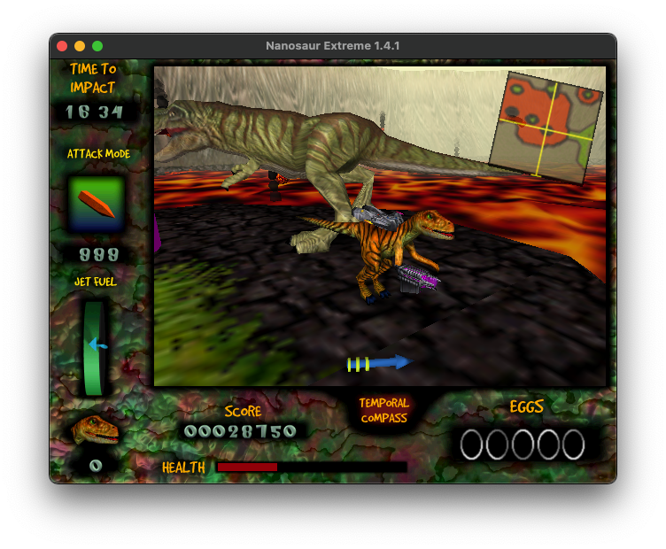

# Nanosaur source port

This is _Nanosaur_ for modern operating systems (macOS, Windows, Linux). This version, at https://github.com/jorio/nanosaur, is approved by Pangea Software.

- **Get builds for macOS and Windows here:** https://github.com/jorio/nanosaur/releases
- Arch Linux users, get [`nanosaur` from the AUR](https://aur.archlinux.org/packages/nanosaur).
- Other systems: please read [BUILD.md](BUILD.md) to build the game yourself. 

## About this port

### Context

Nanosaur is a 1998 Macintosh game by Pangea Software. In it, you’re a cybernetic dinosaur from the future who’s sent back in time 20 minutes before a giant asteroid hits the Earth. And you get to shoot at T-Rexes with nukes.

Nanosaur was bundled with the original iMac and ran on Mac OS 8. It’s also notable for being a prominent showcase of [QuickDraw 3D](https://en.wikipedia.org/wiki/QuickDraw_3D)’s capabilities, which was Apple’s high-level 3D graphics API during the 90s.

In 1999, Pangea released [Nanosaur’s source code](https://www.pangeasoft.net/nano/nanosource.html) to the public. This port is based on that release.
(Note: the restrictive terms in that link are ancient — Pangea does [endorse the existence of this port today](https://www.pangeasoft.net/nano/files.html).)

### Project goals

This port aims to provide the best way to experience Nanosaur today. It introduces some modern comforts (such as support for arbitrary resolutions) and fixes some gameplay bugs. The overall experience is intended to be faithful to the spirit of the original game, so modifications to the game’s design are out of the scope of this project.

To make it easier to port the game, I wrote an implementation of parts of the Macintosh Toolbox API, which I called “[Pomme](https://github.com/jorio/Pomme)”. You can think of Pomme as a cross-platform reimagining of [Carbon](https://en.wikipedia.org/wiki/Carbon_(API)), albeit at a much smaller scope.
Later, I extended Pomme to port several other Pangea games from the Mac OS 7-9 era (see “other Pangea game ports” below).

The first release of this port used a [custom fork](https://github.com/jorio/Quesa) of [Quesa](https://github.com/jwwalker/Quesa) to render the game’s 3D graphics. Quesa is an independent implementation of QuickDraw 3D; it was incredibly useful to get the game up and running initially. Nanosaur has switched to a tailor-made renderer as of version 1.4.2.

### Credits

Nanosaur™ © 1998 Pangea Software, Inc.
- Programming: Brian Greenstone
- Artwork: Scott Harper 
- Music: Mike Beckett, Jens Nilsson
- Cinematics: Chris Ashton
- Enhanced update: Iliyas Jorio

Nanosaur was updated and re-released here (https://github.com/jorio/nanosaur) with permission by Pangea Software.

### License

This version of Nanosaur is licensed under [CC NC-BY-SA 4.0](LICENSE.md).

### Other Pangea game ports

If you like games by Pangea Software, you might also enjoy my ports of
[Bugdom](https://github.com/jorio/Bugdom), [Otto Matic](https://github.com/jorio/OttoMatic), and [Mighty Mike (aka Power Pete)](https://github.com/jorio/MightyMike).

